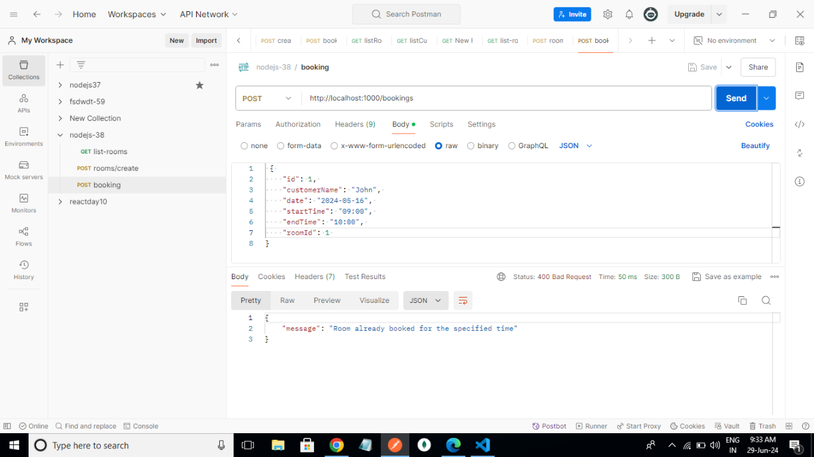
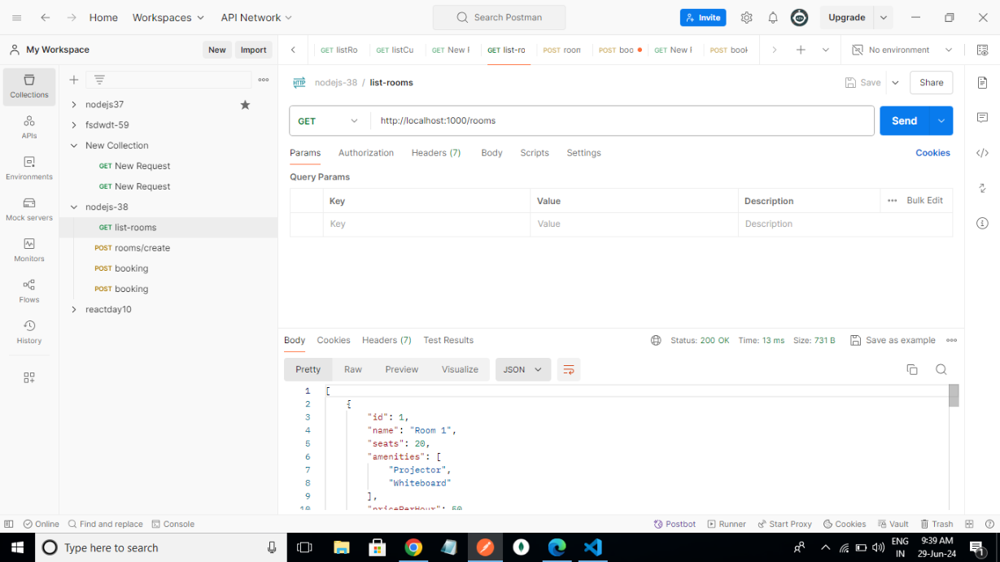
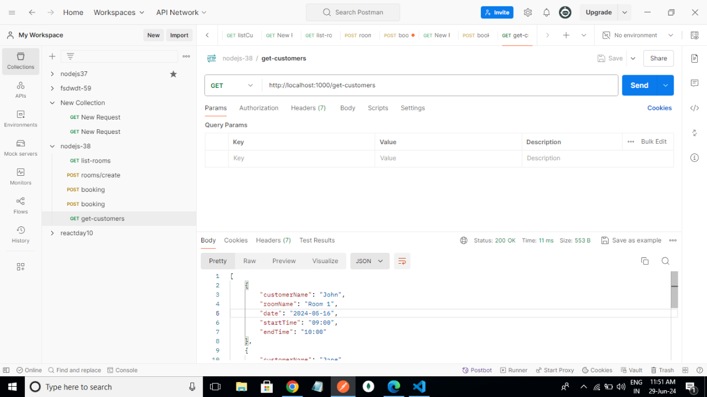
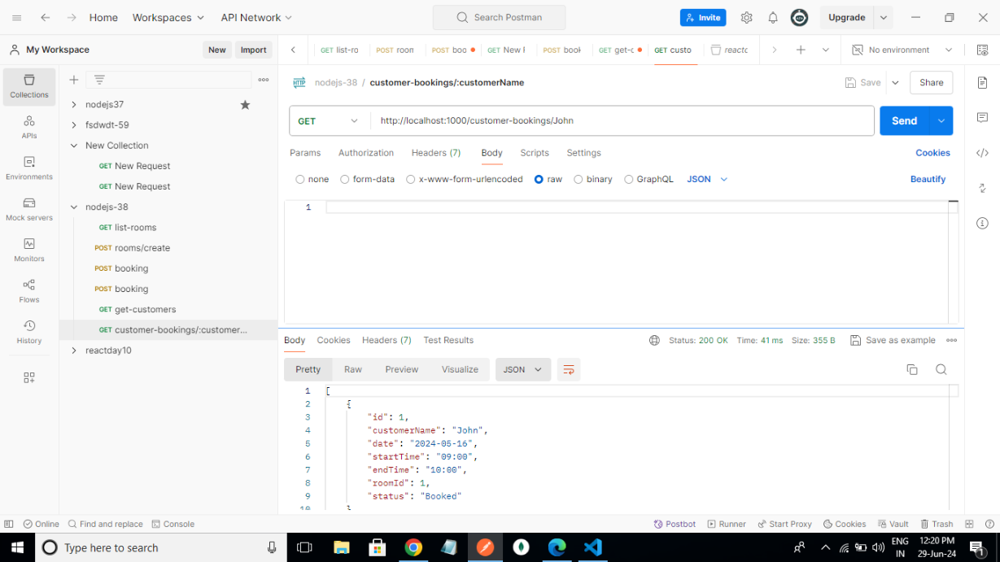

# Day 38th Task
# Web Developer Task - Hall Booking API 
## **Procedure**

step1: Open file manager then select project name [hall-bookingAPI] tpye cmd then open command prompt type (code .) then create vs code.

step2: - Create an empty directory

   - Generate a package.json file by running npm init -y or npm init

   - Install the required dependencies:

   - npm install express
   
   - Create an entry point file (index.js) in the root directory

step3: vs code -> to create .gitignore file and index.js file and README.md file for the task

step4: Then i use [postman] App -> Add collection -> then create [ nodejs-38 ] -> Then Add GET Request for get my result.

step5: Then deployed for github and Render.com

## **Description**

- Create and Booking Rooms && List the Rooms and Customers

- Completed My Task 

- Kindly see my Answers in the npm run dev for kind attention or

- Use an app called "Postman" Or

- Enter this link into the app called "Postman"

**They are shown below**

**1.Creating a room**

POST: [http://localhost:1000/rooms/create]

**2. Booking a room**

POST: [http://localhost:1000/bookings]

**Already booking:**

**Booking successful:**

**3. Listing all booked rooms**

GET: [http://localhost:1000/rooms]

**4. Listing all booked customers**

GET: [http://localhost:1000/get-customers]

**5. List how many times a customer has booked the room with details**

GET: [http://localhost:1000/customer-bookings/John]

Result:

We can see the output in render.com link [ https://hall-bookingapi-u9dd.onrender.com ]

 --> https://hall-bookingapi-u9dd.onrender.com/rooms/create[post method]
 --> https://hall-bookingapi-u9dd.onrender.com/bookings[post method]
 --> https://hall-bookingapi-u9dd.onrender.com/rooms[Get method]
 --> https://hall-bookingapi-u9dd.onrender.com/get-customers[Get method]
 --> https://hall-bookingapi-u9dd.onrender.comcustomer-bookings/John[Get method]

 
